# Codebase Graph

Generated: 2026-04-06T09:34:40.504Z

Branch: `codex/mvp-figma`

Remote: `https://github.com/shvmsntsh/gymmate-complete.git`

## Purpose

This snapshot is a reusable architecture map for future change requests. It is intentionally compact so an agent can orient on the repo without re-reading every source file.

## Workspace Summary

- `gymmate_backend`: 51 scanned files, 107 internal dependency edges
- `gymmate_admin_vite`: 22 scanned files, 40 internal dependency edges
- `gymmate_mobile`: 65 scanned files, 136 internal dependency edges

## System Graph

```mermaid
graph TD
  Repo["gymmate-complete / codex-mvp-figma"]
  Repo --> Backend["Backend API"]
  Repo --> Admin["Admin Web"]
  Repo --> Mobile["Mobile App"]
  Backend --> backend__api_auth["/api/auth"]
  Backend --> backend__api_gym["/api/gym"]
  Backend --> backend__api_invite["/api/invite"]
  Backend --> backend__api_onboarding["/api/onboarding"]
  Backend --> backend__api_user["/api/user"]
  Backend --> backend__api_plans["/api/plans"]
  Backend --> backend__api_member["/api/member"]
  Backend --> backend__api_trainer["/api/trainer"]
  Backend --> backend__api_owner["/api/owner"]
  Backend --> backend__api_messages["/api/messages"]
  Admin --> admin_Home["Home: /"]
  Admin --> admin_Login["Login: /login"]
  Admin --> admin_RegisterGym["RegisterGym: /register-gym"]
  Admin --> admin_AdminDashboard["AdminDashboard: /dashboard"]
  Admin --> admin_ManageMembers["ManageMembers: /manage-members"]
  Admin --> admin_Invites["Invites: /invites"]
  Admin --> admin_BrandingStudio["BrandingStudio: /branding"]
  Admin --> admin_GymDetails["GymDetails: /gyms/:id"]
  Mobile --> mobile_BrandedLoadingScreen["BrandedLoadingScreen"]
  Mobile --> mobile_GamifiedEntryScreen["GamifiedEntryScreen"]
  Mobile --> mobile_MainNavigationScaffold["MainNavigationScaffold"]
  Admin --> Backend
  Mobile --> Backend
```



## Backend API Mounts

### /api/auth

- Route file: `gymmate_backend/routes/authRoutes.js`
- `POST /register` -> gymmate_backend/controllers/userController.js#register
- `POST /login` -> gymmate_backend/controllers/userController.js#login
- `POST /quick-login` -> gymmate_backend/controllers/userController.js#quickLogin
- `GET /me` -> gymmate_backend/controllers/userController.js#getUserProfile
- `GET /user-details-for-plan` -> gymmate_backend/controllers/userController.js#getUserDetailsForPlan
- `POST /complete-onboarding` -> gymmate_backend/controllers/userController.js#updateOnboardingStatus
- `GET /dashboard/stats` -> gymmate_backend/controllers/userController.js#getDashboardStats
- `GET /members/categorized` -> gymmate_backend/controllers/userController.js#getCategorizedMembers

### /api/gym

- Route file: `gymmate_backend/routes/gymRoutes.js`
- `POST /register` -> req.body
- `GET /list` -> req.user, res.status
- `POST /login` -> req.body
- `GET /services` -> gymmate_backend/models/Gym.js#find
- `GET /services/distribution` -> req.user, res.status
- `GET /branding/:gymId` -> gymmate_backend/models/Gym.js#findById, req.params, branding.logoUrl, branding.primaryColor, branding.secondaryColor, branding.logoScale, branding.logoOffsetX, branding.logoOffsetY
- `PUT /branding` -> req.user, res.status
- `GET /members` -> req.user, gymmate_backend/models/User.js#find
- `GET /all-members` -> req.user, res.status
- `GET /self` -> req.user, req.user, res.status
- `GET /login-stats` -> req.user, res.status
- `POST /generate-invite` -> req.body, req.user, generator.role, generator.role, Math.random

### /api/invite

- Route file: `gymmate_backend/routes/inviteRoutes.js`
- `POST /register` -> req.body, res.status
- `POST /validate` -> req.body, console.error
- `POST /verify` -> req.body, console.error
- `POST /generate` -> authenticateToken, inviteControllerGenerate
- `GET /list` -> authenticateToken, listInviteCodes
- `POST /superadmin-create` -> req.user, req.user, console.error

### /api/onboarding

- Route file: `gymmate_backend/routes/onboardingRoutes.js`
- `GET /status` -> getOnboardingStatus
- `POST /start` -> startOnboarding
- `POST /step` -> saveStepProgress
- `POST /complete` -> completeOnboarding
- `GET /badges` -> getUserBadges
- `GET /progress` -> getUserProgress
- `POST /reset` -> resetOnboarding

### /api/user

- Route file: `gymmate_backend/routes/userRoutes.js`
- `POST /register-member` -> req.body, res.status
- `PUT /profile` -> authenticateToken, updateProfile
- `GET /me` -> authenticateToken, getMe
- `GET /gym-members` -> authenticateToken, getGymMembers
- `GET /count` -> gymmate_backend/models/User.js#countDocuments
- `GET /gym-dashboard-stats` -> authenticateToken, getGymDashboardStats

### /api/plans

- Route file: `gymmate_backend/routes/planRoutes.js`
- `GET /meal` -> gymmate_backend/controllers/planController.js#getMealPlanForUser
- `GET /workout` -> gymmate_backend/controllers/planController.js#getWorkoutPlanForUser
- `POST /:memberId/:type` -> gymmate_backend/controllers/planController.js#trainerUpdatePlan

### /api/member

- Route file: `gymmate_backend/routes/memberRoutes.js`
- `GET /progress-participation` -> gymmate_backend/controllers/userController.js#getMemberProgressParticipation
- `GET /plan-log` -> gymmate_backend/controllers/planLogController.js#getMemberPlanLog
- `PUT /plan-log` -> gymmate_backend/controllers/planLogController.js#upsertMemberPlanLog

### /api/trainer

- Route file: `gymmate_backend/routes/trainerRoutes.js`
- `GET /attendance-progress` -> gymmate_backend/controllers/trainerController.js#getTrainerAttendanceProgress
- `GET /dashboard` -> gymmate_backend/controllers/trainerController.js#getTrainerDashboard
- `GET /clients` -> gymmate_backend/controllers/trainerController.js#getTrainerClients
- `GET /clients/:memberId/summary` -> gymmate_backend/controllers/trainerController.js#getTrainerClientSummary
- `GET /clients/:memberId/activity` -> gymmate_backend/controllers/trainerController.js#getTrainerClientActivity

### /api/owner

- Route file: `gymmate_backend/routes/ownerRoutes.js`
- `GET /trainers` -> gymmate_backend/controllers/ownerController.js#getOwnerTrainers
- `GET /assignments` -> gymmate_backend/controllers/ownerController.js#getOwnerAssignments
- `PUT /members/:memberId/assignment` -> gymmate_backend/controllers/ownerController.js#assignMemberToTrainer
- `DELETE /members/:memberId/assignment` -> gymmate_backend/controllers/ownerController.js#unassignMember

### /api/messages

- Route file: `gymmate_backend/routes/messageRoutes.js`
- `GET /conversations` -> gymmate_backend/controllers/messageController.js#getConversations
- `POST /conversations` -> gymmate_backend/controllers/messageController.js#createConversation
- `GET /conversations/:id/messages` -> gymmate_backend/controllers/messageController.js#getConversationMessages
- `POST /conversations/:id/messages` -> gymmate_backend/controllers/messageController.js#postMessage

## Admin Routes

- `/` -> `gymmate_admin_vite/src/views/HomePage.vue` (Home)
- `/login` -> `gymmate_admin_vite/src/views/LoginPage.vue` (Login)
- `/register-gym` -> `gymmate_admin_vite/src/views/RegisterGym.vue` (RegisterGym)
- `/dashboard` -> `gymmate_admin_vite/src/views/AdminDashboard.vue` (AdminDashboard)
- `/manage-members` -> `gymmate_admin_vite/src/views/ManageMembers.vue` (ManageMembers)
- `/invites` -> `gymmate_admin_vite/src/views/InvitesView.vue` (Invites)
- `/branding` -> `gymmate_admin_vite/src/views/BrandingStudio.vue` (BrandingStudio)
- `/gyms/:id` -> `gymmate_admin_vite/src/views/GymDetails.vue` (GymDetails)

## Mobile Navigation Anchors

- Named route `/onboarding` -> `OnboardingFlow`
- Auth gate targets: `BrandedLoadingScreen`, `GamifiedEntryScreen`, `MainNavigationScaffold`

## Trees

### gymmate_backend

```text
gymmate_backend
├── api
│   └── index.js
├── app.js
├── controllers
│   ├── aiController.js
│   ├── authController.js
│   ├── gymController.js
│   ├── inviteController.js
│   ├── messageController.js
│   ├── onboardingController.js
│   ├── ownerController.js
│   ├── planController.js
│   ├── planLogController.js
│   ├── trainerController.js
│   └── userController.js
├── firebase.json
├── gymmate_admin
├── gyms.json
├── index.js
├── middleware
│   └── authMiddleware.js
├── models
│   ├── Conversation.js
│   ├── DailyPlanLog.js
│   ├── Gym.js
│   ├── InviteCode.js
│   ├── mealPlan.js
│   ├── Message.js
│   ├── plan.js
│   ├── PlanCache.js
│   ├── TrainerAssignment.js
│   ├── User.js
│   └── workoutPlan.js
├── package-lock.json
├── package.json
├── public
│   └── index.html
├── routes
│   ├── aiRoutes.js
│   ├── authRoutes.js
│   ├── gymRoutes.js
│   ├── inviteRoutes.js
│   ├── memberRoutes.js
│   ├── messageRoutes.js
│   ├── onboardingRoutes.js
│   ├── ownerRoutes.js
│   ├── planRoutes.js
│   ├── trainerRoutes.js
│   └── userRoutes.js
├── scripts
│   ├── migrate-default-gym.js
│   ├── seed-demo-data.js
│   └── seed-qa-data.js
├── seed
│   ├── seed_mealPlans.json
│   ├── seed_workoutPlans.json
│   └── seedPlans.js
├── services
│   └── coachingService.js
├── utils
│   └── roles.js
└── vercel.json
```

### gymmate_admin_vite

```text
gymmate_admin_vite/src
├── App.vue
├── assets
│   └── main.css
├── components
│   ├── AdminBrand.vue
│   ├── AdminShell.vue
│   ├── AdminThemeToggle.vue
│   ├── PublicAuthShell.vue
│   ├── StatCard.vue
│   └── StateBlock.vue
├── composables
│   └── useAdminTheme.js
├── lib
│   └── api.js
├── main.js
├── plugins
│   └── vuetify.js
├── router
│   └── index.js
├── styles
└── views
    ├── AdminDashboard.vue
    ├── BrandingStudio.vue
    ├── GymDetails.vue
    ├── HomePage.vue
    ├── InvitesView.vue
    ├── Login.vue
    ├── LoginPage.vue
    ├── ManageMembers.vue
    └── RegisterGym.vue
```

### gymmate_mobile

```text
gymmate_mobile/lib
├── api
│   ├── api_config.dart
│   └── api_constants.dart
├── forks
│   └── charts_flutter
├── main.dart
├── models
│   ├── dashboard_models.dart
│   ├── invite_code_model.dart
│   └── user_progress_model.dart
├── pages
│   ├── admin_dashboard_page.dart
│   ├── branding_settings_page.dart
│   ├── coach_page.dart
│   ├── conversation_page.dart
│   ├── gamified_entry_screen.dart
│   ├── gym_member_dashboard_page.dart
│   ├── gym_owner_dashboard_page.dart
│   ├── gym_trainer_dashboard_page.dart
│   ├── home_page.dart
│   ├── invite_code_list_page.dart
│   ├── login_page.dart
│   ├── onboarding
│   ├── plan_page.dart
│   ├── profile_page.dart
│   ├── quick_join_screen.dart
│   ├── register_page.dart
│   ├── splash_entry_page.dart
│   ├── splash_screen.dart
│   ├── trainer_clients_page.dart
│   └── trainer_messages_page.dart
├── providers
│   ├── auth_provider.dart
│   └── onboarding_provider.dart
├── services
│   ├── ai_service.dart
│   ├── api_dashboard_service.dart
│   ├── auth_service.dart
│   ├── coaching_service.dart
│   ├── invite_service.dart
│   ├── messaging_service.dart
│   └── onboarding_service.dart
├── theme.dart
├── themes
│   ├── app_colors.dart
│   └── app_theme.dart
├── utils
│   ├── branding_utils.dart
│   ├── logo_picker_io.dart
│   ├── logo_picker_stub.dart
│   ├── logo_picker_web.dart
│   ├── logo_picker.dart
│   └── role_utils.dart
└── widgets
    ├── animated_background.dart
    ├── animated_form_field.dart
    ├── brand_loader.dart
    ├── brand_logo.dart
    ├── confetti_success.dart
    ├── dashboard_charts.dart
    ├── editorial_dashboard_mobile.dart
    ├── editorial_mobile.dart
    ├── editorial_onboarding.dart
    ├── entry_carousel.dart
    ├── phase_one_shell.dart
    ├── progress_bar.dart
    └── role_card.dart
```

## Entrypoint Dependencies

### gymmate_backend

- `gymmate_backend/index.js`
  - `gymmate_backend/app.js`
- `gymmate_backend/app.js`
  - `gymmate_backend/routes/authRoutes.js`
  - `gymmate_backend/routes/gymRoutes.js`
  - `gymmate_backend/routes/inviteRoutes.js`
  - `gymmate_backend/routes/memberRoutes.js`
  - `gymmate_backend/routes/messageRoutes.js`
  - `gymmate_backend/routes/onboardingRoutes.js`
  - `gymmate_backend/routes/ownerRoutes.js`
  - `gymmate_backend/routes/planRoutes.js`
  - `gymmate_backend/routes/trainerRoutes.js`
  - `gymmate_backend/routes/userRoutes.js`

### gymmate_admin_vite

- `gymmate_admin_vite/src/main.js`
  - `gymmate_admin_vite/src/App.vue`
  - `gymmate_admin_vite/src/assets/main.css`
  - `gymmate_admin_vite/src/plugins/vuetify.js`
  - `gymmate_admin_vite/src/router`
- `gymmate_admin_vite/src/router/index.js`
  - `gymmate_admin_vite/src/lib/api.js`

### gymmate_mobile

- `gymmate_mobile/lib/main.dart`
  - `gymmate_mobile/lib/pages/admin_dashboard_page.dart`
  - `gymmate_mobile/lib/pages/gym_member_dashboard_page.dart`
  - `gymmate_mobile/lib/pages/gym_owner_dashboard_page.dart`
  - `gymmate_mobile/lib/pages/invite_code_list_page.dart`
  - `gymmate_mobile/lib/pages/onboarding/onboarding_flow.dart`
  - `gymmate_mobile/lib/pages/profile_page.dart`
  - `gymmate_mobile/lib/pages/splash_screen.dart`
  - `gymmate_mobile/lib/providers/auth_provider.dart`
  - `gymmate_mobile/lib/providers/onboarding_provider.dart`
  - `gymmate_mobile/lib/themes/app_colors.dart`
  - `gymmate_mobile/lib/themes/app_theme.dart`
  - `gymmate_mobile/lib/utils/branding_utils.dart`
  - `gymmate_mobile/lib/utils/role_utils.dart`
